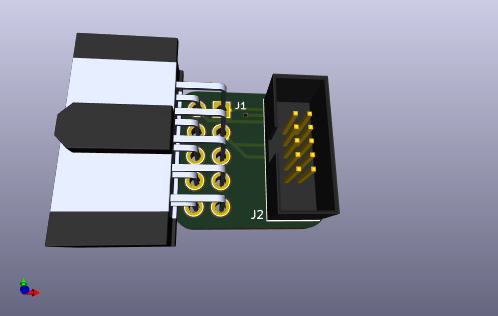

# 2x5toCortexAdapt

2x5 0.1" (2.54mm) header to arm cortex 10-pin header adapter. This is useful
when connecting ST-Link v2 clones to a standard ARM 2x5 1.27mm pitch header.

## Variants

I know of 2 variants of the ST-Link v2, with different pinouts on the 2x5 0.1"
(2.54mm) header. Different adapter boards provided for each variant.

### Variant 1

Older model I bought in ~2016.

From the pin 1 marker on the header on the ST-Link, pinout is as follows:

|Funtion|Pin|Pin|Function|
|---|---|---|---|
|RST (mislabeled on silkscreen)|1|2|SWDIO|
|GND (mislabeled on silkscreen)|3|4|GND|
|SWIM|5|6|SWCLK|
|3.3V|7|8|3.3V|
|5.0V|9|10|5.0V|

Note that the labeling is incorrect for some pins on the etching on the case and
on the silkscreen on the board.

### Variant 2

Newer model I bought in 2020.

From the pin 1 marker on the header on the ST-Link, pinout is as follows:

|Funtion|Pin|Pin|Function|
|---|---|---|---|
|RST|1|2|SWCLK|
|SWIW|3|4|SWDIO|
|GND|5|6|GND|
|3.3V|7|8|3.3V|
|5.0V|9|10|5.0V|

Labeling appears to be correct on these devices.

## PCB Renders

..

### Varian-1 3d render

### Variant-2 3d highlight

## Parts

[2x5 header](http://www.digikey.com/product-search/en?keywords=SFH11-PBPC-D05-RA-BK)
[arm 10 pin](http://www.digikey.com/product-detail/en/3220-10-0100-00/1175-1627-ND/3883661)
