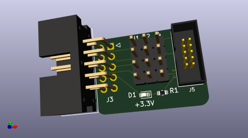
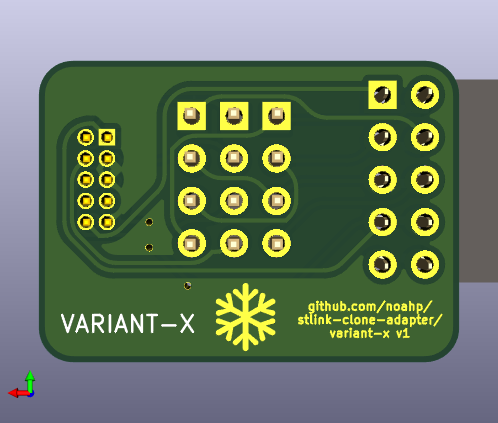
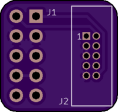
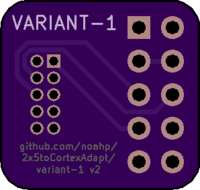
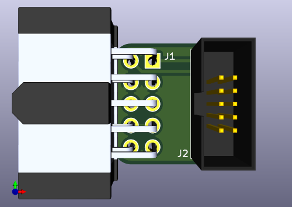
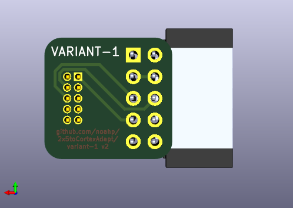
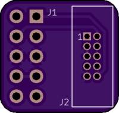

# stlink-clone-adapter

2x5 0.1" (2.54mm) header to arm cortex 10-pin header adapter. This is useful
when connecting ST-Link v2 clones to a standard ARM 2x5 1.27mm pitch header.

## Variants

I know of 2 variants of the ST-Link v2 clones, with different pinouts on the 2x5 0.1"
(2.54mm) header. Different adapter boards provided for each variant.

One way to distinguish the variants; when unplugged, check for continuity on pins 3+4 or 5+6.

- pins 3+4 shorted, **variant-1**
- pins 5+6 shorted, **variant-2**

### Variant 1

Older model I bought in ~2016.

From the pin 1 marker on the header on the ST-Link, pinout is as follows:

|Funtion|Pin|Pin|Function|
|---|---|---|---|
|RST*|1|2|SWDIO|
|GND*|3|4|GND|
|SWIM|5|6|SWCLK|
|3.3V|7|8|3.3V|
|5.0V|9|10|5.0V|

**Note that the labeling is incorrect for some pins on the etching on the case /
on the silkscreen on the board. My device had the pinout for **Variant-2** on
the etching and just incorrect on the silkscreen markings 🤷.*

### Variant 2

Newer model I bought in 2020.

From the pin 1 marker on the header on the ST-Link, pinout is as follows:

|Funtion|Pin|Pin|Function|
|---|---|---|---|
|RST|1|2|SWCLK|
|SWIW|3|4|SWDIO|
|GND|5|6|GND|
|3.3V|7|8|3.3V|
|5.0V|9|10|5.0V|

Labeling appears to be correct on these devices.

### Variant X

Support both pinouts with a 3x4 0.1" header to select between them.

## PCB Renders

### Variant-1

### Variant-2

## Parts

- [2x5 header](http://www.digikey.com/product-search/en?keywords=SFH11-PBPC-D05-RA-BK)
- [arm 10 pin](http://www.digikey.com/product-detail/en/3220-10-0100-00/1175-1627-ND/3883661)
- [2x4 shunt/jumper](https://www.digikey.com/en/products/detail/amphenol-icc-fci/69145-208LF/1523748) [alternate](https://www.digikey.com/en/products/detail/samtec-inc/MNT-104-BK-G/6613574)

